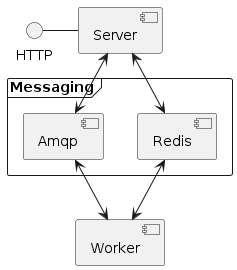

.. highlight:: python

.. _server_description:

Description
===========

|ProjectName| is an **draft** implementation of the `OGC Processes api <https://www.ogc.org/standard/ogcapi-processes/>`_ standards Open Geospatial Consortium based on the QGIS Processing API.

This implementation allows you to expose and run on a server:

* QGIS Processing models and scripts
* QGIS plugins having a Processing provider according to their ``metadata.txt`` file

.. _server_features:

Features
--------

- Asynchronous
- Horizontally scalable 
- Routing specifications
- Handle schemas for all Qgis parameters 
- OAPI compliant

.. _server_requirements:

Requirements and limitations
----------------------------

- Linux/Posix OS
- Python 3.12+ only
- Redis server
- RabbitMQ server
- QGIS 3.34+

Overview
--------

|ProjectName| is built on top of the  `Celery <https://github.com/celery/celery>`_  framework.

A |ProjectName| Celery **Worker** expose the necessary  tasks for

* Listing exposed Qgis algorithms as OGC processes
* Returning process description
* Executing a Qgis algorithm

A |ProjectName| **Server** expose an OGC processes compliant api and handle messages and 
results from the **Worker**.

   The simplest configuration

Running multiple workers and servers
------------------------------------

Worker and servers and independant components and
you may run any server and workers as different services on different
environments.

This enable running workers in different environments and infrastructure
according to your requirements.

* You may for example have a worker running intensive Jobs on a dedicated pool of 
  machine/vm while  other jobs may be run on smallest architecture.

* Some wokers may run on specific environments likes different Qgis versions
  or using specific libraries

Services
--------

Each worker is bound to a *service* that represents a set of Qgis processing providers
and Qgis projects.

The **Server** route execution messages to specific services: how routing is done depends
on the selected access policy from the configuration.

The default access policy select the service from the ``service`` query parameter or take the first
available service. Other acces policy will consider a pecific header and much more sophisticated 
routing can be achieve by implementing custom access policy.

Since we run `Celery <https://github.com/celery/celery>`_  behind the scene, there is no need
to declare the services to the front end servers; once a worker is deployed, it will be known
known to the servers after some time depending on the configured update interval.

.. figure:: figs/routing.png
   :align: center

   A more complex configuration with multiple services

   
.. _quick_start:

Quick start
===========

.. _docker_compose_setup:

Docker compose setup
--------------------

This is the recommended way to install and run the services:

The simplest configuration for basic working installation is the following

.. code-block:: yaml

    services:
      worker:
        image: 3liz/qjazz:qgis-ltr
        environment:
          CONF_LOGGING__LEVEL: DEBUG
          CONF_WORKER__SERVICE_NAME: "MyService"
          CONF_WORKER__BROKER_HOST: rabbitmq
          CONF_WORKER__BACKEND_HOST: redis:6379/0
          CONF_PROCESSING__WORKDIR: /qgis-workdir
          CONF_PROCESSING__PLUGINS__PATHS: >- 
            ["/qgis-plugins"]
          CONF_PROCESSING__PROJECTS__SEARCH_PATHS: >-
            { 
              "/":"/qgis-projects" 
            }
        depends_on:
        - rabbitmq
        volumes:
        - { type: bind, source: "/path/to/workdir/", target: /qgis-workdir }
        - { type: bind, source: "/path/to/plugins/", target: /qgis-plugins }
        - { type: bind, source: "/path/to/projects", target: /qgis-projects }
        command: ["qjazz-processes", "worker"]
      server:
        image: 3liz/qjazz:qgis-ltr
        ports:
        - 127.0.0.1:9080:9080
        command: ["qjazz-processes", "serve", "-v"]
        environment:
          CONF_EXECUTOR__CELERY__BROKER_HOST: rabbitmq
          CONF_EXECUTOR__CELERY__BACKEND_HOST: redis:6379/0
      rabbitmq:
        image: rabbitmq:3-alpine
      redis:
        image: redis:6-alpine

Alternatively you may use a configuration file:

.. code-block:: yaml

    services:
      worker:
        image: 3liz/qjazz:qgis-ltr
        depends_on:
        - rabbitmq
        volumes:
        - { type: bind, source: "/path/to/worker.toml", target: /worker.toml }
        - { type: bind, source: "/path/to/workdir/", target: /qgis-workdir }
        - { type: bind, source: "/path/to/plugins/", target: /qgis-plugins }
        - { type: bind, source: "/path/to/projects", target: /qgis-projects }
        command: ["qjazz-processes", "worker", "-C", "/etc/worker.toml"]
      server:
        image: 3liz/qjazz:qgis-ltr
        ports:
        - 127.0.0.1:9080:9080
        command: ["qjazz-processes", "serve", "-v"]
        environment:
          CONF_EXECUTOR__CELERY__BROKER_HOST: rabbitmq
          CONF_EXECUTOR__CELERY__BACKEND_HOST: redis:6379/0
      rabbitmq:
        image: rabbitmq:3-alpine
      redis:
        image: redis:6-alpine

With the ``worker.toml`` configuration file:

.. code-block:: toml

    [worker]
    service_name = "MyService"
    backend_host = "redis:6379/0"
    broker_host = "rabbitmq"

    [processing]
    workdir = "/qgis-workdir"
    
    [processing.plugins]
    paths = ["/qgis-plugins"]

    [processing.projects.search_paths]
    '/' = "/qgis-projects"

    
The |ProjectName| applications take care of configuring Celery for using Redis and RabbitMQ so
you usually do not have to deal directly with the Redis or RabbitMQ setup.

For more details, refer to  https://docs.celeryq.dev/en/stable/getting-started/backends-and-brokers/rabbitmq.html and https://docs.celeryq.dev/en/stable/getting-started/backends-and-brokers/redis.html 
for how they are configured with Celery

Installing from source
----------------------

You can install directly from source by cloning the reposittory and
running :code:`make install` for installing all python modules.

Running the worker and the server is as simple as:

.. code-block:: bash

   qjazz-processing serve -C <worker-configuration-file>

and

.. code-block:: bash

   qjazz-processes server -C <server-configuration-file>

.. warning::

   | You should always install the python modules in a python venv
   | with the :code:`--system-site-packages` option so that you can
     access PyQGIS modules. 

